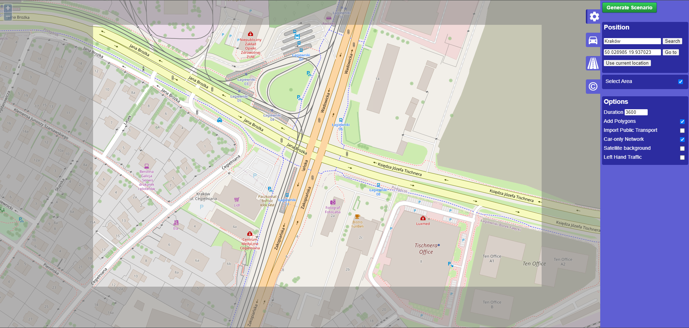
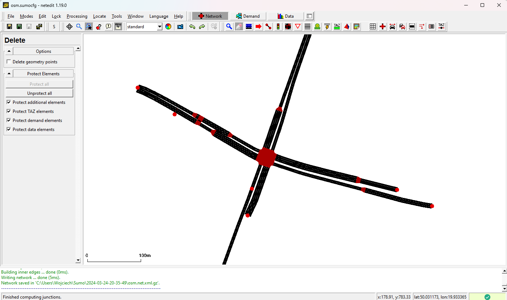
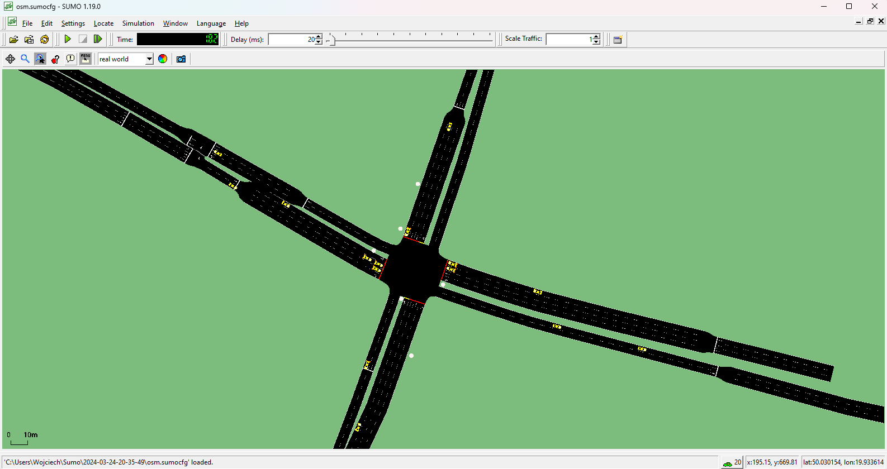

# Etap 2 - Analiza i wybór narzędzi

## SUMO

W pierwszym etapie projektu zdecydowano się na wykorzystanie symulatora ruchu drogowego SUMO.
Narzędzie to, oprócz samego silnika symulacyjnego, posiada kilka narzędzi, które pozwalają na modelowania środowiska
symulacji. Jednym z nich jest **OSM Web Wizard**, który pozwala na import mapy z OpenStreetMap do symulatora.
Można za pomocą niego wybrać dowolny obszar na świecie, skonfigurować co powinno zostać zaimportowane, a następnie
wygenerować pliki konfiguracyjne dla SUMO.

Kolejnym narzędziem jest **netedit**, który pozwala na dokładną edycję sieci dróg i ruchu w modelowanym środowisku.
Można za jego pomocą tworzyć środowiska od zera, ale również importować pliki konfiguracyjne wygenerowane przez OSM Web
Wizard
i, na przykład, usunąć niepotrzebne zaimportowane z mapy elementy.

**SUMO-GUI** to narzędzie, które pozwala na wizualizację symulacji. Można za jego pomocą obserwować ruch pojazdów i
zmiany świateł w czasie.

## TraCI

SUMO posiada również API do języka Python, które pozwala na sterowanie symulacją z poziomu kodu.
W każdym kroku symulacji można sprawdzić i edytować aktualny jej stan. Jej działanie można zobaczyć na krótkim
[przykładzie](../sumo-app/notebooks/stage_2.ipynb).

## PyGAD

Do implementacji algorytmu genetycznego zdecydowano się na bibliotekę [PyGAD](https://pypi.org/project/pygad/).
Pozwala ona na łatwe tworzenie algorytmów genetycznych w języku Python poprzez dobór funkcji fitness, stretegii
selekcji, typu mutacji i wielu innych parametrów. Oprócz tego, biblioteka posiada bogatą dokumentację i wiele przykładów
użycia.