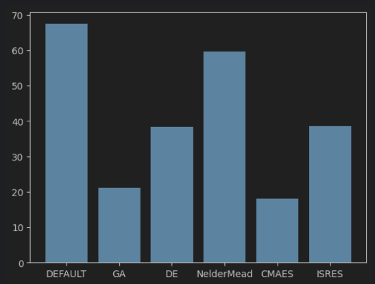

# Etap 4 - Prototyp, działające pierwsze elementy

## Wstęp

W ramach etapu przeprowadzono [eksperymenty](../sumo-app/notebooks/stage_4.ipynb) z różnymi algorytmami optymalizacyjnymi dostępnymi w bibliotece **pymoo**.
Wykorzystane algorytmy to:
- **GA** - klasyczny algorytm genetyczny
- **DE** - algorytm ewolucji różnicowej
- **NelderMead** - algorytm Nelder-Mead
- **CMAES** - algorytm ewolucji kowariancji macierzy
- **ISRES** - algorytm ewolucji z indywidualnymi i zmiennymi rozmiarami populacji

Dla każdego z nich przeprowadzono optymaliację na 2500 osobnikach z domyślnymi hiperparametrami. Dla wiekszości z nich
stworzono pierwotną populację z domyślną wartością, a dla **CMAES** zastosowano strategię ewolucji z populacją losową.

## Wyniki

Na wykresie przedstawiono wyniki optymalizacji dla każdego z algorytmów. Najlepsze wyniki uzyskano dla algorytmu 
**CMAES** (pomimo faktu, że w populacji startowej nie znalazł się domyślny osobnik). Podobne wyniki uzyskano dla
klasycznego algorytmu genetycznego **GA**. Dla pozoatałych algorytmów wyniki były niezadowalające. Wynika stąd, że
przy dalszych eksperymentach warto skupić się na algorytmach **CMAES** oraz **GA**, które przy odpowiednich 
hiperparametrach, mogą dać jeszcze lepsze wyniki. 

Z ekspreymentów wynika również, że wymagana będzie zmiana modelu, otrzymywane wyniki czasu trwania faz świateł nie są
realistyczne, a sama symulacja bardzo uproszczona w celu przyspieszenia obliczeń. Wydaje się, że warto będzie poświęcić
skalę optymalizacji na rzecz jej bardziej realistycznego wyniku.
