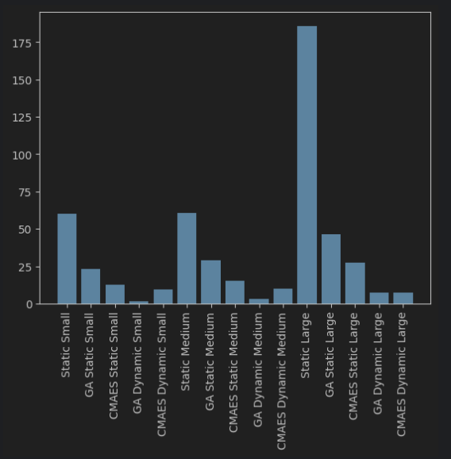

# Etap 5 - Prototyp: działa większość funkcji, pierwsze wyniki

## Wstęp

W ramach etapu zdecydowano się na zmianę strategii zmiany świateł. Zamiast stałych cykli poszczególnych faz, zdecydowano
się na dynamiczne zmiany faz świateł w zależności od natężenia ruchu. W tym celu zaimplementowano prosty algorytm
i nową funkcję fitness, która optymalizowała jego parametry, a następnie przeprowadzono 
[eksperymenty](../sumo-app/notebooks/stage_5.ipynb) z algorytmami GA i CMAES dla różnego natężenia ruchu.

## Algorytm zmiany świateł

W każdym kroku symulacji sprawdzana jest ilość pojazdów oczekujących na czerwonym świetle na poszczególnych pasach.
Spośród nich wybierani są kandydaci do zmiany świateł na podstawie kryterów:
- ilość pojazdów oczekujących musi być większa niż `min_cars` lub czas oczekiwania na czerwonym świetle musi być 
większy niż `max_time`
- żadne z konfliktujących świateł nie może być żółte zmieniające się w zielone
- każde z konfliktujących świateł musi być zielone przez co najmniej `min_time`
- stosunek ilości pojazdów oczekujących na każdym konfliktującym pasie do ilości pojazdów oczekujących na pasie 
kandydata musi być mniejszy niż `ratio`

## Wyniki

