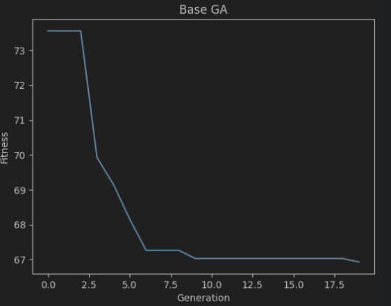
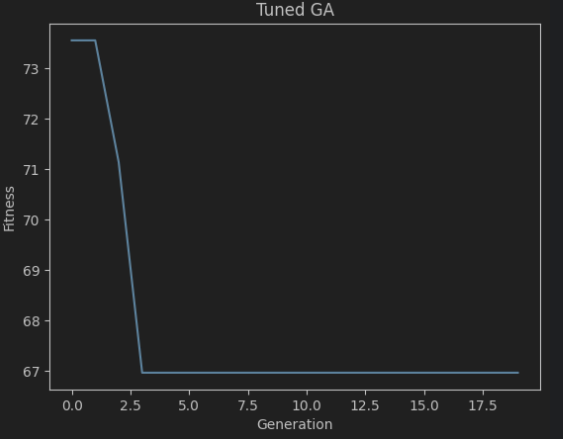

# Etap 6 - Osiągnięte cele, wyniki testów, analiza wyników

W ramach etapu przygotowano dane testowe o bardzo dużym zagęszczeniu ruchu, nowe auta pojawiały się na skrzyżowaniu
co 0.5 sekundy i przeprowadzono na nich [eksperymenty](../sumo-app/notebooks/stage_6.ipynb). Najpierw sprawdzono jaki
wynik jest w stanie osiągnąć algorytm przygotowany w ramach etapu 5, kiedy do obliczenia jego parametrów wykorzystany
zostanie klasyczny algorytm genetyczny z domyślnymi w bibliotece **pymoo** hiperparametrami:

```python
{
    "mating.mutation.eta": 20,
    "mating.mutation.prob": 0.9,
    "mating.crossover.prob_bin": 0.5,
    "mating.crossover.prob_exch": 1.0,
    "mating.crossover.eta": 15,
    "mating.crossover.prob_var": 0.5,
    "mating.crossover.prob": 0.9,
}
```



Następnie przeprowadzono optymalizację hiperparametrów algorytmu genetycznego. W tym celu wykorzystano framework
[**optuna**](https://optuna.org/), który jest polecany przez twórców **pymoo**. W wyniku optymalizacji uzyskano
następujące hiperparametry:

```python
{
    "mating.mutation.eta": 14.182840277226372,
    "mating.mutation.prob": 0.7149860376838261,
    "mating.crossover.prob_bin": 0.5358964059155116,
    "mating.crossover.prob_exch": 0.6637946452197888,
    "mating.crossover.eta": 16.90200602557433,
    "mating.crossover.prob_var": 0.8556758047926507,
    "mating.crossover.prob": 0.7932775202509965,
}
```



Algorytm genetyczny po optymalizacji był w stanie znaleźć optymalne rozwiązanie dużo szybciej.

### Podsumowanie

- W ramach projektu udało się zaimplementować algorytm sterowania ruchem na skrzyżowaniu, który osiąga znacznie lepsze
  wyniki niż klasyczne podejścia oparte o stałe cykle świateł.
- Po analizia wyników dla stałych cykli świateł, jak i dla dynamicznego algorytmu sterowania ruchem, można zauważyć,
  że dużo lepiej sprawdzają się rozwiązania oparte o krótkie i szybko zmieniające się cykle świateł. Takie rozwiązania
  są raczej rzadko spotykane w rzeczywistości, a więc pojawia się pytanie jak takie rozwiązanie sprawdziłoby się w
  praktyce.
- **sumo** to bardzo rozbudowane narzędzie pozwalające na dokładną symulację ruchu drogowego, jego API zapewnia dużą
  elastyczność, a dokumentacja oraz dostępne materiały są wystarczające by dostosować program do swoich potrzeb.
  Niestety, posiada dwie bardzo istotne w przypadku optymaliacji wady: jest wolne i nie wspiera wielowątkowości.
- **pymoo** świetnie sprawdza się jako narzędzie do optymalizacji, posiada wiele wbudowanych algorytmów i umożliwia
  ich wykorzystywanie dla tego samego problemu
